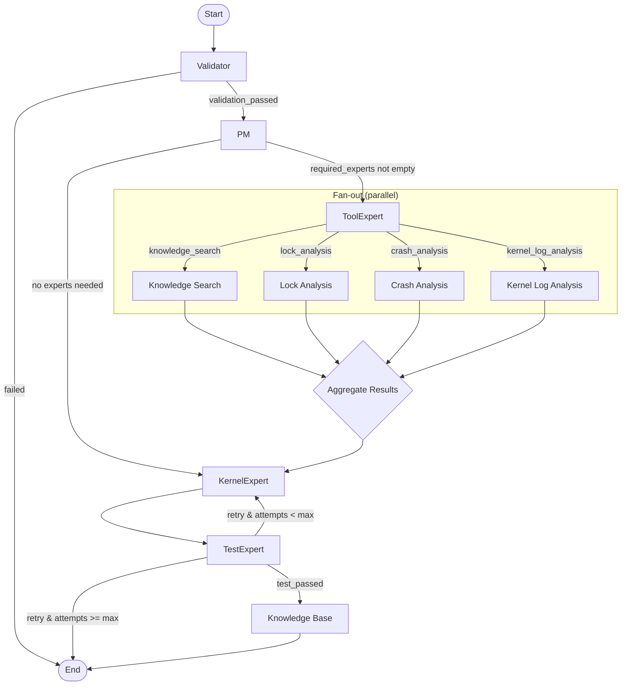

# Workflow



# How to use

## 1. Configure LLM

Edit `config.json`:

```json
{
  "base_url": "https://api.openai.com/v1",
  "api_key": "sk-...",
  "model_name": "gpt-4o"
}
```

## 2. Write your problem description

Create `input.txt` (see `input.txt.template`):

```text
Bug Promote: 内核发生 Mutex ABBA 死锁导致 hung_task panic。两个线程以相反顺序获取两个 mutex，形成死锁。
vmcore: ./outputs/deadlock/vmcore.elf
vmlinux: ./outputs/deadlock/vmlinux
boot_kernel: ./outputs/deadlock/bzImage
kernel_source: /home/zouyipeng/workspace/linux_mainline/linux
```

Only `Bug Promote` is required — paths are optional but improve analysis quality.

## 3. Run

```bash
pip install -r requirements.txt
python3 main.py
```

With custom paths:

```bash
python3 main.py my_input.txt --config my_config.json
```

## 4. Output

- Analysis results printed to stdout
- Session logs saved to `sessions/<session_id>/`
- Knowledge base entries archived to `knowledge_base/`
